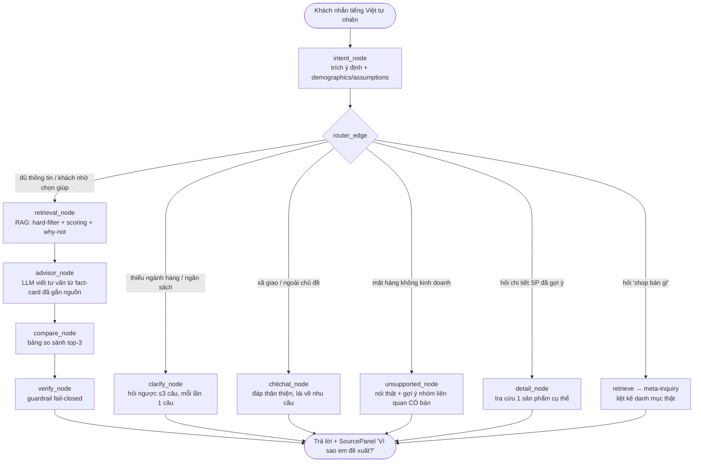

# Trợ lý AI bán hàng điện máy — "Super-Salesperson" cho Điện Máy Xanh

> **Vietnam Innovation Challenge 2026 · Track 🏢 Năng suất SME**
> Bài toán do **Công ty Cổ phần Đầu tư Điện Máy Xanh** (dienmayxanh.com) đặt ra:
> *"Trợ lý AI so sánh và tư vấn sản phẩm theo nhu cầu thật của khách hàng."*
---

**Trợ lý ảo bán hàng điện máy thế hệ mới** là hệ thống tư vấn bán hàng thông minh chạy trên nền tảng Web, đóng vai trò như một **"Super-salesperson"** – nhân viên bán hàng xuất sắc nhất của doanh nghiệp – có khả năng tư vấn cá nhân hóa đồng thời cho hàng nghìn khách hàng, hoạt động liên tục 24/7.

Hệ thống hiểu tiếng Việt đời thường, biết **chủ động hỏi ngược** đúng những câu hỏi quan trọng để nắm nhu cầu thực sự của khách, từ đó đề xuất **top-3 sản phẩm phù hợp nhất** kèm phân tích đánh đổi (trade-off) bằng ngôn ngữ bình dân, dễ hiểu. Đặc biệt, hệ thống cam kết **không bịa số liệu (Zero-Hallucination)** – mọi thông tin đưa ra đều bám sát dữ liệu sản phẩm thực tế.

Đây là một giải pháp tư vấn khép kín, tự động hóa toàn bộ hành trình khách hàng: từ **tư vấn chọn sản phẩm**, **bán chéo (Cross-selling)** để tăng giá trị đơn hàng, đến **chăm sóc khách hàng sau mua**.

---

Đây là bản MVP chạy end-to-end (backend FastAPI + frontend React), xây trên **đúng bộ dữ liệu đề bài cấp** — không dùng dữ liệu mẫu tự chế.

---

## Mục lục

- [Trợ lý AI bán hàng điện máy — "Super-Salesperson" cho Điện Máy Xanh](#trợ-lý-ai-bán-hàng-điện-máy--super-salesperson-cho-điện-máy-xanh)
  - [Mục lục](#mục-lục)
  - [1. Bối cảnh \& bài toán](#1-bối-cảnh--bài-toán)
  - [2. Giải pháp: Trợ lý bán hàng khép kín \& toàn diện](#2-giải-pháp-trợ-lý-bán-hàng-khép-kín--toàn-diện)
    - [🎯 Điểm khác biệt cốt lõi](#-điểm-khác-biệt-cốt-lõi)
  - [3. Luồng sản phẩm hiện tại](#3-luồng-sản-phẩm-hiện-tại)
    - [Diễn giải luồng](#diễn-giải-luồng)
    - [Ví dụ một lượt hội thoại thật](#ví-dụ-một-lượt-hội-thoại-thật)
  - [4. Tính năng đang có](#4-tính-năng-đang-có)
  - [5. Chống bịa số liệu — 3 lớp guardrail](#5-chống-bịa-số-liệu--3-lớp-guardrail)
  - [6. Dữ liệu \& phạm vi](#6-dữ-liệu--phạm-vi)
  - [7. Kiến trúc \& công nghệ](#7-kiến-trúc--công-nghệ)
  - [8. Cách chạy](#8-cách-chạy)
    - [Backend](#backend)
    - [Frontend](#frontend)
    - [Test \& eval](#test--eval)
  - [9. Cấu trúc thư mục](#9-cấu-trúc-thư-mục)
  - [10. Cơ hội \& lộ trình tương lai](#10-cơ-hội--lộ-trình-tương-lai)
    - [🛒 Hoàn thiện hành trình bán hàng](#-hoàn-thiện-hành-trình-bán-hàng)
    - [🧠 Hiểu khách sâu hơn](#-hiểu-khách-sâu-hơn)
    - [🔌 Sẵn sàng vận hành thực tế](#-sẵn-sàng-vận-hành-thực-tế)

---

## 1. Bối cảnh & bài toán

Khi mua điện thoại, máy lạnh, tủ lạnh hay bất kì sản phẩm điện máy nào, khách hàng phổ thông **không cần hiểu rõ bảng thông số** — họ cần biết sản phẩm nào *hợp với hoàn cảnh của mình*: ngân sách bao nhiêu, dùng cho ai, phòng bao nhiêu m², ưu tiên tiết kiệm điện hay hiệu năng. Nhưng phần lớn công cụ hiện nay chỉ liệt kê công suất, dung tích, RAM, BTU… cạnh nhau, khiến khách khó hiểu và khó quyết định.

| | Hiện trạng | Hệ quả |
|---|---|---|
| **Bộ lọc & bảng so sánh** (TGDĐ/ĐMX) | Bắt khách tự hiểu kỹ thuật | Khách phổ thông bỏ cuộc |
| **Chatbot FAQ / kịch bản** | Trả lời một chiều, thụ động | Không khai thác được nhu cầu thật |
| **Hỏi thẳng ChatGPT/Gemini** | Dễ "ảo tưởng", bịa giá/thông số | Thảm hoạ vận hành cho nhà bán lẻ |

**Câu hỏi trọng tâm của đề bài:**
> *Làm thế nào để xây một trợ lý AI hiểu nhu cầu thật của khách, chủ động hỏi thêm khi thiếu thông tin, và so sánh sản phẩm bằng ngôn ngữ dễ hiểu — thay vì chỉ liệt kê thông số kỹ thuật?*

**Đối tượng phục vụ (hai nhóm trong một chuỗi giá trị):**
- **Người mua sắm phổ thông** — không rành công nghệ, chỉ biết mô tả hoàn cảnh ("mua cho ba mẹ ở quê", "phòng trọ hay cúp điện", "tầm 7 triệu"). Bot dịch hoàn cảnh đó thành lựa chọn phù hợp.
- **Nhà bán lẻ điện máy** (khách trả tiền) — tăng tỷ lệ chuyển đổi từ traffic sẵn có, giảm tải chăm sóc, và thu được dữ liệu hội thoại để hiểu khách thật sự cần gì.

---

## 2. Giải pháp: Trợ lý bán hàng khép kín & toàn diện

Hệ thống mô phỏng tư duy của một **"super-salesperson"** — không chỉ tìm sản phẩm, mà **bán hàng có trách nhiệm** trên toàn bộ hành trình khách hàng, từ tư vấn đến sau mua:

* 🗣️ **Thấu hiểu tiếng Việt đời thường** — xử lý mượt câu không dấu, sai chính tả, viết tắt, teencode, từ địa phương và trộn Anh-Việt (code-switching); tự động chuẩn hóa & quy đổi đơn vị thực tế (phòng 20m², "máy lạnh 1 ngựa/HP", BTU, inch, lít) — khách mô tả hoàn cảnh, hệ thống lo phần thông số, thay vì bắt khách tự lọc bộ lọc kỹ thuật khô khan.

* 🔎 **Chủ động hội thoại & khắc họa chân dung khách hàng (Customer Profiling)** — nếu thiếu thông tin quyết định, bot hỏi ngược **từng câu một, câu quan trọng trước**; đồng thời phân tích nhân khẩu học (độ tuổi, giới tính, nghề nghiệp...) qua tương tác để xây dựng chân dung khách, từ đó cá nhân hóa chuỗi câu hỏi tiếp theo nhằm khai thác đúng nhu cầu thực. Những gì khách chưa nói được ghi nhận là "chưa biết" — **không tự đoán**.

* 📊 **Tư vấn minh bạch bằng kiến trúc RAG** — truy xuất **real-time** thông số, giá bán, khuyến mãi và tồn kho thật từ Catalog/API; đề xuất **top-3 sản phẩm tối ưu**, phân tích rõ điểm đánh đổi (trade-off) bằng ngôn ngữ bình dân, và chỉ thẳng sản phẩm nào **không nên chọn** (why-not).

* 🛡️ **Cam kết Zero-Hallucination** — mọi con số đều gắn nguồn trích xuất, được **log kiểm chứng**; thiếu dữ liệu thì nói thẳng "chưa có thông tin", **không bao giờ bịa** — chống ảo giác bằng kiến trúc, không bằng lời hứa.

* 🛒 **Bán chéo thông minh (Cross-selling)** — ngay khi khách chốt sản phẩm, bot dựa vào dữ liệu sản phẩm đi kèm để gợi mở nhu cầu mới (ví dụ: ưu đãi mua kèm tai nghe, ốp lưng khi chốt điện thoại) và chủ động đề xuất **giải pháp mua sắm trọn gói**, tăng giá trị đơn hàng.

* 🧭 **Gợi mở & điều hướng hành động sau tư vấn (Next-Best-Action)** — sau khi trình top-3, bot không dừng ở "đây là danh sách, khách tự lo tiếp" mà chủ động chốt bước kế tiếp như một nhân viên thật: **đặt hàng hộ** ngay trong hội thoại (tạo đơn nháp, xác nhận thông tin giao nhận), **lưu ghi chú / sản phẩm quan tâm** để khách quay lại quyết sau mà không phải tư vấn lại từ đầu, hoặc **chỉ cửa hàng gần nhất còn hàng** để khách qua trải nghiệm trực tiếp — rút ngắn tối đa khoảng cách từ *"được tư vấn"* đến *"chốt đơn"*.

* 🔄 **Thuyết phục & xử lý hết hàng (Out-of-Stock Handling)** — khi sản phẩm khách tìm không có sẵn, bot đóng vai nhân viên tư vấn khéo léo: **thẳng thắn thừa nhận thiếu hàng**, rồi lập tức phân tích và giới thiệu sản phẩm tương đương cùng mục đích sử dụng để thuyết phục khách chuyển đổi.

* 💬 **Chăm sóc khách hàng sau mua** — với shop có lưu lịch sử mua hàng, bot kiêm luôn vai trò CSKH cơ bản: trả lời về thời hạn bảo hành, chính sách ưu đãi và các quyền lợi liên quan.

### 🎯 Điểm khác biệt cốt lõi

* **Đảo ngược quy trình tư vấn** — khách không cần biết kỹ thuật, chỉ cần mô tả hoàn cảnh (*"phòng 20m², sợ tốn điện"*); hệ thống tự quy đổi sang thông số. Chatbot thường bắt khách hiểu máy — chúng tôi bắt máy hiểu khách.

* **Hyper-Localization** — hiểu tiếng Việt như người Việt nhắn tin thật: không dấu, teencode, vùng miền, dân gian ("máy lạnh", "1 ngựa"), trộn Anh-Việt.

* **Zero-Hallucination bằng kiến trúc, không bằng lời hứa** — RAG + guardrail fail-closed 3 lớp: không có nguồn kiểm chứng thì *bị chặn* trả lời, nói thẳng "chưa có dữ liệu". Mọi con số đều truy vết được qua log.

---

## 3. Luồng sản phẩm hiện tại

Luồng phục vụ mặc định (**`agent_core`**) là một **agent-graph LangGraph** (`StateGraph` + `MemorySaver`) chạy trên SQLite. Thay vì xử lý mọi tin nhắn theo một đường ống cứng nhắc duy nhất, hệ thống được thiết kế như một **đồ thị trạng thái**: mỗi tin nhắn của khách trước tiên đi qua bước **trích ý định (intent)**, sau đó **bộ định tuyến (router)** quyết định câu này thuộc "kịch bản" nào để chuyển vào đúng nhánh xử lý — bởi trong thực tế bán hàng, **không phải câu nào của khách cũng là câu đi tìm sản phẩm**: có câu chỉ là chào hỏi xã giao, có câu hỏi "shop bán gì", có câu hỏi sâu về một sản phẩm vừa được gợi ý.



### Diễn giải luồng

**Nhánh chính — đề xuất sản phẩm:** `intent → router → retrieval → advisor → compare → verify`. Đây là "xương sống" của hệ thống, mô phỏng đúng trình tự tư duy của một nhân viên bán hàng giỏi:

1. **`intent_node`** — đọc hiểu câu nói tự nhiên của khách (kể cả không dấu, viết tắt), trích ra ý định, ngành hàng, ngân sách, đồng thời ghi nhận các suy luận về nhân khẩu học (demographics/assumptions) để cá nhân hóa các bước sau.
2. **`retrieval_node`** — trái tim của kiến trúc RAG: lọc cứng (hard-filter) theo điều kiện bắt buộc (ngân sách, ngành hàng), chấm điểm (scoring) theo mức độ phù hợp với ưu tiên của khách, và tính luôn lý do **why-not** — vì sao các sản phẩm khác bị loại.
3. **`advisor_node`** — LLM viết lời tư vấn, nhưng **chỉ được viết dựa trên fact-card đã gắn nguồn** do retrieval trả về, không được tự chế thông tin.
4. **`compare_node`** — dựng bảng so sánh top-3 trực quan để khách quyết nhanh.
5. **`verify_node`** — chốt chặn cuối cùng (guardrail fail-closed): đối soát mọi con số trong câu trả lời với nguồn; phát hiện sai lệch thì chặn lại thay vì cho đi qua.

**Bốn nhánh phụ** (`clarify`, `chitchat`, `unsupported`, `detail`) là thứ giúp bot ứng xử như **người bán thật** thay vì một cỗ máy chỉ biết trả về danh sách:

- **`clarify_node`** — khi khách chưa nói đủ thông tin quyết định (thiếu ngành hàng hoặc ngân sách), bot **hỏi ngược từng câu một, tối đa 3 câu**, câu quan trọng hỏi trước — đúng cách một nhân viên tinh ý khai thác nhu cầu, không "tra khảo" khách bằng một loạt câu hỏi cùng lúc.
- **`chitchat_node`** — với câu xã giao hoặc lạc chủ đề, bot đáp lại thân thiện rồi khéo léo lái câu chuyện về nhu cầu mua sắm.
- **`unsupported_node`** — khi khách hỏi mặt hàng shop **không kinh doanh**, bot nói thật thay vì bịa, đồng thời gợi ý nhóm hàng liên quan mà shop **có bán** — biến một câu "không có" thành cơ hội giữ chân khách.
- **`detail_node`** — khi khách hỏi sâu về một sản phẩm vừa được gợi ý, bot tra cứu chi tiết đúng sản phẩm đó thay vì chạy lại cả quy trình đề xuất.

Toàn bộ trạng thái hội thoại được lưu qua `MemorySaver` trên SQLite, nên bot **nhớ ngữ cảnh xuyên suốt phiên**: khách trả lời câu hỏi ngược ở lượt sau, bot vẫn ghép được với nhu cầu đã khai ở lượt trước.

Đồ thị này cũng được thiết kế **mở về phía sau**: sau `verify_node`, kiến trúc cho phép nối thêm nhánh **`next_action`** — gợi mở bước kế tiếp cho khách sau khi xem top-3 (đặt hàng hộ, lưu ghi chú sản phẩm quan tâm, tìm cửa hàng gần còn hàng) — chỉ bằng cách thêm node vào `StateGraph`, không phải viết lại luồng. Phần này thuộc [lộ trình mục 10](#10-cơ-hội--lộ-trình-tương-lai).

### Ví dụ một lượt hội thoại thật
> **Khách:** *"e muon mua may lanh duoi 20tr cho phong 18m2, tiet kiem dien, it on"*
> → Bot hiểu: cần **máy lạnh** · ngân sách **≤ 20 triệu** · phòng **18m²** · ưu tiên **tiết kiệm điện, ít ồn** — dù câu không dấu, viết tắt.
>
> **Bot (hỏi ngược đúng chỗ):** *"Dạ phòng 18m² này là phòng ngủ hay phòng khách ạ?"*
> → Sau khi đủ thông tin: đề xuất **top-3** kèm trade-off ("êm nhất nhưng đắt nhất" / "cân bằng" / "rẻ hơn hẳn nhưng bảo hành ngắn"), **giải thích cả vì sao loại** nhóm non-inverter, và mỗi con số đều bấm xem được nguồn.

Lượt hội thoại trên đi qua đúng các nhánh của đồ thị: `intent` bóc tách được 4 ràng buộc từ một câu không dấu → `clarify` phát hiện thiếu thông tin công năng phòng và chỉ hỏi **đúng 1 câu** → khi đủ dữ kiện, nhánh chính `retrieval → advisor → compare → verify` chạy trọn vẹn và trả về đề xuất có nguồn kiểm chứng qua **SourcePanel "Vì sao em đề xuất?"**.

---

## 4. Tính năng đang có

Các tính năng dưới đây **đã hiện thực hoá và có test bao phủ** trong MVP:

| # | Tính năng | Mô tả ngắn | Vị trí trong code |
|---|---|---|---|
| 1 | **Hiểu tiếng Việt tự nhiên** | Không dấu, viết tắt ("20tr", "18m2"), quy đổi ngân sách/đơn vị; NLU qua LLM + **fallback tất định** khi mất API | `app/nlu/`, `app/agent_core/intent.py` |
| 2 | **Định tuyến ý định thông minh** | Phân biệt: tìm mua · xã giao · hỏi "shop bán gì" · hỏi mặt hàng không có · hỏi chi tiết sản phẩm | `agent_core/agent_engine.py` (`router_edge`) |
| 3 | **Hỏi ngược có kỷ luật** | Tối đa **3 câu**, mỗi lần 1 câu, câu quan trọng trước, **không hỏi lại điều đã biết** | `agent_core/agent_engine.py` (`clarify_node`) |
| 4 | **Tôn trọng khi khách từ chối** | "gợi ý đại đi" → vẫn tư vấn được (3 tầm giá đại diện), nêu rõ **giả định** đã dùng | `retriever.price_spread_products` |
| 5 | **RAG có cấu trúc** | Hard-filter ngân sách + **deterministic preference scoring** (diễn giải được) + semantic re-rank (tuỳ chọn) | `app/retrieval/`, `agent_core/retriever.py` |
| 6 | **Top-3 + trade-off + why-not** | 3 sản phẩm đa dạng brand/giá, phân tích đánh đổi, **chỉ rõ nhóm không nên chọn** | `agent_core/advisor.py` |
| 7 | **Bảng so sánh trực quan** | Đặt cạnh nhau các tiêu chí khách quan tâm | `agent_core/compare.py`, `frontend/.../ComparisonTable.jsx` |
| 8 | **"Vì sao em đề xuất máy này?"** | Panel nguồn: mỗi con số ghi rõ *(giá từ catalog / thông số nhà sản xuất)* + liệt kê cả thứ **chưa có dữ liệu** | `app/advice/provenance.py`, `SourcePanel.jsx` |
| 9 | **Nói thẳng khi thiếu dữ liệu** | Tồn kho / review / trả góp không có trong data → **luôn** trả lời "chưa có dữ liệu" | guardrail (mục 5) |
| 10 | **Streaming câu trả lời (SSE)** | `status` theo tiến trình + phát **từng dòng đã kiểm chứng grounding** ngay khi LLM viết xong | `app/main.py` `/api/chat/stream`, `advisor.py` |
| 11 | **Tư vấn nâng/hạ ngân sách** | "rẻ hơn/cao cấp hơn" → đổi khoảng giá quanh anchor, câu trả lời **tất định** (không qua LLM) | `app/advice/budget.py` |
| 12 | **Hội thoại nhiều lượt, PII-safe** | Nhớ ngữ cảnh qua `MemorySaver`; **không log nội dung khách** | `agent_core/engine.py`, `app/session.py` |

*Suy luận sơ bộ chân dung khách (demographics/assumptions) đã có ở tầng intent — bot chỉ suy đoán khi khách nói rõ và **luôn tuyên bố giả định**. Persona-driven questioning đầy đủ nằm ở [lộ trình](#10-cơ-hội--lộ-trình-tương-lai).*

---

## 5. Chống bịa số liệu — 3 lớp guardrail

Đây là **"trái tim không bịa"** của giải pháp và là câu trả lời trực tiếp cho tiêu chí *"không hallucination"* của đề bài. Mọi câu trả lời có đề xuất đi qua **3 lớp bảo vệ độc lập, fail-closed**:

| Lớp | Cơ chế | Chặn được gì |
|---|---|---|
| **(a) Chỉ cấp facts đã gắn nguồn** | LLM **không bao giờ** thấy catalog thô — chỉ thấy `facts_for_llm`: giá + thông số của đúng 3 sản phẩm top-3, mỗi giá trị mang nhãn nguồn | LLM lấy số từ sản phẩm không liên quan hoặc từ kiến thức nền |
| **(b) System prompt cấm bịa** | Prompt cấm ước lượng tiền điện/kWh/%, cấm cộng gộp/làm tròn số, buộc nói "chưa có dữ liệu" cho mục thiếu | Giảm xu hướng model tự tin đoán (lớp mềm) |
| **(c) Verifier fail-closed** | Trích **mọi con số** trong câu trả lời LLM, đối chiếu tập số hợp lệ trong fact-card; số lạ → **bỏ câu trả lời LLM**, thay bằng bản tóm tắt dựng thẳng từ catalog | Chặn cứng bất kể LLM có nghe lời hay không — **lớp quyết định** |

Vì lớp (c) không phụ thuộc việc LLM có tuân thủ prompt hay không, hệ thống đạt thuộc tính:
> **Mọi số liệu tới người dùng đều truy được về một dòng trong catalog đã chuẩn hoá — hoặc câu trả lời nói "chưa có dữ liệu".**

Điều này được đo bằng `eval/run_eval.py` (`hallucination_rate` = 0.0 trên tập kịch bản chuẩn) và `tests/test_eval.py` chứng minh bằng phản chứng: nhét một câu cố tình bịa số → verifier bắt được → `hallucination_rate = 1.0`. Với **streaming**, mỗi dòng được kiểm chứng grounding **trước khi phát** ra màn hình.

> ⚠️ *Giới hạn nêu trung thực:* verifier bắt sai lệch **định lượng** (số). Nhận định **định tính** sai (LLM diễn giải sai ý nghĩa một spec bằng chữ) chưa bị chặn — đây là rủi ro còn lại, nằm trong [lộ trình](#10-cơ-hội--lộ-trình-tương-lai). Chi tiết đầy đủ: [`docs/ARCHITECTURE.md`](docs/ARCHITECTURE.md).

---

## 6. Dữ liệu & phạm vi

Hệ thống tư vấn dựa trên **đúng bộ dữ liệu sản phẩm mà đề bài cung cấp** — không dùng dữ liệu mẫu tự chế. Toàn bộ bảng thông số gốc (file Excel) được làm sạch và đưa vào một cơ sở dữ liệu nội bộ (`products.db`) để bot tra cứu, gồm **8.746 sản phẩm · 14 ngành hàng · 129 thương hiệu**:

| Ngành hàng | Số sản phẩm | Có giá | Ngành hàng | Số sản phẩm | Có giá |
|---|---:|---:|---|---:|---:|
| Tủ lạnh | 1.692 | 252 | Máy nước nóng | 319 | 148 |
| Máy tính bảng | 1.469 | 307 | Tủ mát, tủ đông | 222 | 132 |
| Máy giặt | 1.337 | 204 | Máy in | 147 | 57 |
| Đồng hồ thông minh | 1.336 | 582 | Máy rửa chén | 134 | 59 |
| Máy lạnh | 1.039 | 269 | Máy sấy quần áo | 107 | 38 |
| Màn hình máy tính | 469 | 68 | Micro karaoke | 37 | 5 |
| Máy tính để bàn | 405 | 77 | Micro thu âm | 33 | 24 |
| | | | **Tổng** | **8.746** | **2.222 (~25%)** |

**Dữ liệu thật vốn không hoàn hảo — và hệ thống xử lý điều đó một cách trung thực thay vì che giấu** (đúng điều đề bài dặn tránh):

- **Khoảng 75% sản phẩm không có thông tin giá.** Với những sản phẩm này, bot ghi nhận rõ *"chưa có dữ liệu giá"* và **không đưa vào danh sách xếp hạng theo ngân sách** — tuyệt đối không tự chế ra một mức giá "nghe hợp lý".
- **Dữ liệu gốc không có thông tin tồn kho, đánh giá của người mua, hay chính sách trả góp.** Vì vậy khi khách hỏi những nội dung này, bot **luôn trả lời thẳng "chưa có dữ liệu"** thay vì đoán.
- **Dữ liệu gốc khá lộn xộn:** thông số và đơn vị bị viết dính vào nhau trong ô chữ ("313 lít", "1720W - 2050W"), nhiều ô bỏ trống không theo quy luật, thậm chí không có cột tên sản phẩm riêng (hệ thống phải tự ghép tên từ thương hiệu + thông số nổi bật). Toàn bộ những rắc rối này được xử lý ngay ở bước nạp và chuẩn hóa dữ liệu, để các bước tư vấn phía sau luôn làm việc trên dữ liệu sạch.

> Ngoài luồng phục vụ chính, dự án còn giữ lại **một luồng cũ làm phương án dự phòng và đối chiếu** (bật qua cấu hình `PIPELINE=orchestrator`), chạy trên bộ dữ liệu nhỏ hơn phủ 6 ngành hàng. Đây không phải đường phục vụ mặc định.

---

## 7. Kiến trúc & công nghệ

```
Backend  ── Python 3 · FastAPI · LangGraph (StateGraph + MemorySaver) · Pydantic · SQLite
Frontend ── React 18 · Vite
LLM      ── DeepSeek-V4-Flash qua endpoint tương thích OpenAI (/chat/completions)
             → ẩn sau interface LLMClient ⇒ đổi provider / on-prem bất cứ lúc nào, không đụng guardrail
```

**Nguyên tắc thiết kế:**
- **Deterministic là xương sống, LLM là lớp ngôn ngữ.** Lọc, xếp hạng, tính nguồn, verify đều tất định và diễn giải được; LLM chỉ *viết lại* facts đã trích sẵn thành lời tư vấn bình dân.
- **Tách nguồn dữ liệu khỏi pipeline.** `SourcedValue` + fact-card + verifier độc lập với nguồn → thay Excel tĩnh bằng **API thật** (giá/tồn kho/khuyến mãi) chỉ cần viết adapter ở tầng loader, không viết lại lõi.
- **Fail-closed & fail-safe.** Mất LLM → fallback heuristic; số bịa → tóm tắt tất định; stream lỗi → tự chuyển về `/api/chat`.

**API:** `POST /api/chat` · `POST /api/chat/stream` (SSE) · `POST /api/reset` · `GET /api/health`.

Chi tiết pipeline, cơ chế RAG và mapping tiêu chí chấm: [`docs/ARCHITECTURE.md`](docs/ARCHITECTURE.md).

---

## 8. Cách chạy

### Backend

```bash
cd backend
python -m venv .venv
./.venv/Scripts/pip install -r requirements.txt

# products.db (luồng agent_core) đã đi kèm repo. Muốn build lại từ spec sheet:
#   ./.venv/Scripts/python -m app.agent_core.data_ingestion   # đọc Spec_cate_gia.cleaned.xlsx

cp .env.example .env
# rồi sửa .env: LLM_BASE_URL, LLM_API_KEY, LLM_MODEL (mặc định DeepSeek-V4-Flash)

./.venv/Scripts/uvicorn app.main:app --port 8000
```

Biến môi trường chính (`backend/.env`, mẫu ở `.env.example`):

| Biến | Ý nghĩa | Mặc định |
|---|---|---|
| `LLM_BASE_URL` / `LLM_API_KEY` / `LLM_MODEL` | Endpoint tương thích OpenAI + key + tên model | — / — / `DeepSeek-V4-Flash` |
| `PIPELINE` | Luồng phục vụ: `agent_core` (mặc định) hoặc `orchestrator` (fallback) | `agent_core` |
| `AGENT_DB_PATH` | Đường dẫn `products.db` của agent_core | `backend/app/agent_core/products.db` |
| `ENABLE_EMBEDDINGS` | Bật semantic re-rank (cần `sentence-transformers`) | `false` |

### Frontend

```bash
cd frontend
npm install
npm run dev          # mở http://localhost:5173 (backend phải chạy ở :8000; CORS đã mở sẵn)
```

### Test & eval

```bash
cd backend
./.venv/Scripts/pytest -q            # bộ test unit + integration (agent graph, guardrail, NLU, retrieval, API...)
./.venv/Scripts/python eval/run_eval.py   # category_acc, budget_acc, pref_recall, hallucination_rate
```

---

## 9. Cấu trúc thư mục

```
backend/
  app/
    agent_core/     # ★ LUỒNG MẶC ĐỊNH: agent-graph LangGraph trên SQLite
                    #   intent → router → {clarify | chitchat | unsupported | detail
                    #                       | retrieve → advisor → compare → verify}
                    #   (agent_engine, intent, retriever, advisor, compare, detail,
                    #    presenters, data_ingestion, products.db)
    nlu/            # preprocess (không dấu/viết tắt/ngân sách) + parser (LLM → NeedProfile)
    dialogue/       # chính sách hỏi ngược (clarify)
    retrieval/      # hard-filter + deterministic scoring + why-not + semantic re-rank
    advice/         # provenance (fact-card) + generate + verify (guardrail) + budget + streaming
    catalog/        # chuẩn hoá dữ liệu → Product (parsers, category_config, normalize, loader)
    orchestrator.py # luồng cũ (fallback qua PIPELINE=orchestrator)
    main.py         # FastAPI: /api/chat, /api/chat/stream, /api/reset, /api/health
    llm/client.py   # LLMClient (complete_json/complete_text/stream_text) — đổi provider tại đây
  eval/             # scenarios.jsonl + run_eval.py
  tests/            # bộ test unit/integration
frontend/src/       # App.jsx, api.js, components/{Message,SourcePanel,ComparisonTable,QuickSuggestions}.jsx
docs/
  ARCHITECTURE.md   # pipeline + cơ chế RAG + 3 lớp guardrail + mapping tiêu chí chấm
  PILOT.md          # lộ trình pilot 3 tháng (D3)
  TEAM-ROADMAP.md   # chia việc & lộ trình phát triển
Mô tả sản phẩm.md   # tầm nhìn sản phẩm đầy đủ
```

---

## 10. Cơ hội & lộ trình tương lai

MVP hiện dừng ở khâu **tư vấn / đề xuất top-3**. Kiến trúc được thiết kế để mở rộng thẳng lên **luồng bán hàng khép kín** mà đề bài và [`Mô tả sản phẩm.md`](Mô%20tả%20sản%20phẩm.md) mô tả — mỗi hướng đều tận dụng lại guardrail gắn-nguồn đã có:

### 🛒 Hoàn thiện hành trình bán hàng
- **Điều hướng sau tư vấn (Next-Best-Action)** — nối thêm nhánh `next_action` sau `verify_node` để chủ động gợi mở bước kế tiếp ngay khi khách xem xong top-3:
  - **Đặt hàng hộ trong hội thoại** — tạo đơn nháp qua API đơn hàng của nhà bán lẻ, bot thu thập & xác nhận thông tin giao nhận từng bước; đơn chỉ được chốt khi khách xác nhận rõ ràng (human-confirm, không tự ý đặt).
  - **Ghi chú & lưu sản phẩm quan tâm** — khách "để em suy nghĩ thêm" → bot lưu shortlist kèm ghi chú lý do chọn/băn khoăn vào phiên (thiết kế lưu trữ có PII-consent); lần quay lại, bot mở đúng ngữ cảnh cũ thay vì tư vấn lại từ đầu.
  - **Tìm cửa hàng gần còn hàng** — tích hợp store-locator + tồn kho theo chi nhánh: khách muốn "xem tận mắt" → bot chỉ chi nhánh gần nhất **có sẵn đúng model đề xuất**, kèm giờ mở cửa; dữ liệu tồn kho vẫn đi qua guardrail gắn-nguồn, không có dữ liệu thì nói thẳng.
- **Bán chéo thông minh (cross-sell)** — sau khi khách chốt sản phẩm, gợi mở phụ kiện/dịch vụ đi kèm ("mua điện thoại → tai nghe, ốp lưng"; "mua tủ lạnh → gói vệ sinh định kỳ"), vẫn theo nguyên tắc không bịa khuyến mãi phụ kiện.
- **Xử lý hết hàng (out-of-stock) → thuyết phục chuyển đổi** — khi sản phẩm khách tìm không còn, thẳng thắn thừa nhận rồi giới thiệu sản phẩm tương đương cùng mục đích (nền tảng `unsupported_node` đã có sẵn để nâng cấp).
- **Chăm sóc sau mua** — lưu lịch sử mua hàng (thiết kế lưu trữ có PII-consent), trả lời câu hỏi hậu mãi: bảo hành, hướng dẫn dùng, chính sách ưu đãi.

### 🧠 Hiểu khách sâu hơn
- **Persona-driven questioning** — suy luận chân dung khách (độ tuổi, nghề, hoàn cảnh) và điều chỉnh chuỗi câu hỏi tiếp theo theo từng đối tượng.
- **Guardrail định tính** — mở rộng verifier để đối chiếu cả nhận định bằng chữ ("êm nhất tầm giá") với dữ liệu, không chỉ con số.
- **Nhớ xuyên phiên & đa kênh** — web / app / fanpage / voice input.

### 🔌 Sẵn sàng vận hành thực tế
- **Tích hợp API thật** catalog / giá / **tồn kho** / khuyến mãi / review → lấp ~75% dòng thiếu giá, biến "chưa có dữ liệu" thành số liệu thời gian thực (chỉ cần viết adapter ở tầng loader).
- **LLM on-prem** (Qwen/Llama/DeepSeek self-host) qua cùng interface `LLMClient` — đáp ứng yêu cầu **on-premise** & kiểm soát dữ liệu khách của đề bài; guardrail 3 lớp không đổi.
- **Vector DB + learning-to-rank** — tối ưu xếp hạng theo hành vi mua thật; mở rộng thêm ngành hàng chỉ cần thêm một `CategoryConfig`.

> Lộ trình pilot 3 tháng chi tiết (shadow → pilot có kiểm soát → mở rộng, kèm KPI ký hợp đồng): [`docs/PILOT.md`](docs/PILOT.md).
---

